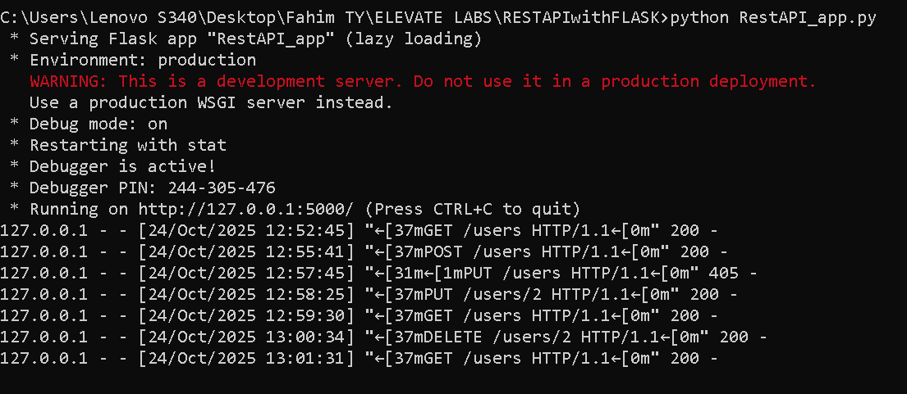
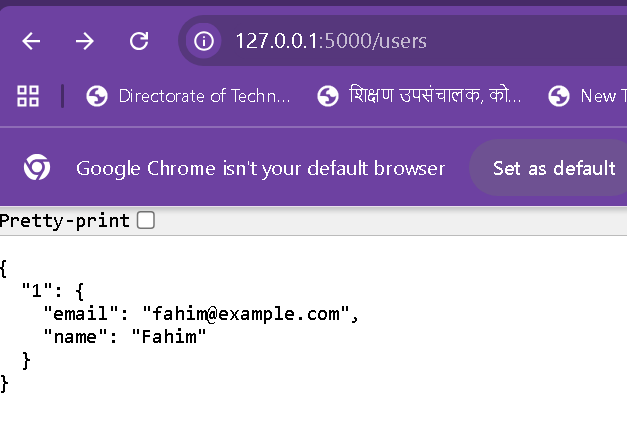

# 🧮 Simple User Management REST API

A simple REST API built with **Python** and **Flask**.  
It allows you to **Create, Read, Update, and Delete (CRUD)** user data stored in memory.

## ⚙️ How to Run :
1. Make sure Python is installed.  
   Check with:
   python --version
2. Open CMD or VS Code Terminal.
3. Go to the folder where app.py (or your Flask file) is saved:
cd path/to/your/project
4. Run the file:
    python RestAPI_app.py
5. The API will run on:
    http://127.0.0.1:5000/

## 🛠️ Tools Used

- **Python** – Programming language used for backend logic  
- **Flask** – Python web framework for building REST APIs  
- **Postman** – Tool for testing API endpoints (GET, POST, PUT, DELETE)  
- **VS Code / Any Code Editor** – To write and run the Python code  
- **CMD / Terminal** – To run Flask server and commands  
- **JSON** – Data format used for request and response bodies

## 🌐 API Endpoints

The API provides the following endpoints for user management:

| Method | Endpoint        | Description                         | Request Body (JSON) Example |
|--------|----------------|-------------------------------------|-----------------------------|
| GET    | `/users`        | Fetch all users in memory           | N/A                         |
| POST   | `/users`        | Add a new user                      | `{ "name": "Afnaan", "email": "afnaan@example.com" }` |
| PUT    | `/users/<id>`   | Update existing user by ID          | `{ "email": "afnaan01@example.com" }` |
| DELETE | `/users/<id>`   | Delete a user by ID                 | N/A                         |

## 🖼️ Example Output

## 🧪 Testing Performed Using Postman with Output
1. GET /users
- Description: Fetch all users in memory.

.png)

2. POST /users
- Description: Add a new user.

.png)

3. PUT /users/2
- Description: Update existing user.

.png)
.png)

4. DELETE /users/1
- Description: Delete a user by ID.

.png)
.png)

## 📋 Features
- In-memory user management
- Supports GET, POST, PUT, DELETE methods
- Easy to test using Postman

## 👨‍💻 Author
**Fahim Shaikh**  

SY BTECH in Computer Science & Engineering
